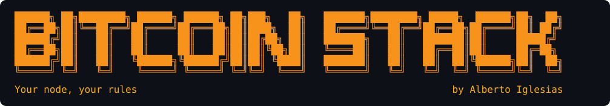
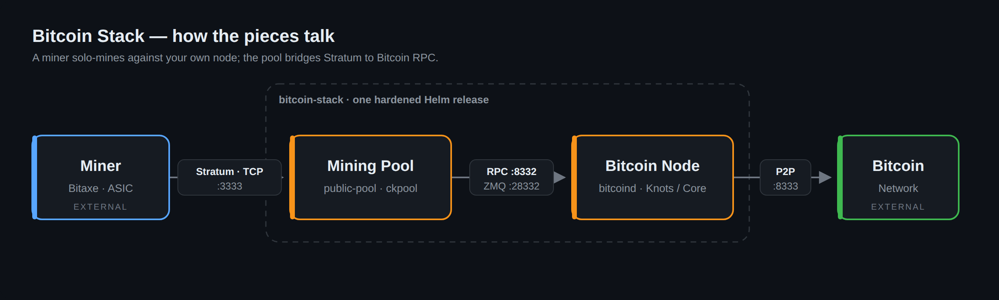

<p align="center">
  
</p>

<p align="center">
  <b>Run your own Bitcoin node and solo-mine to it on Kubernetes</b><br/>
  One hardened, signed Helm chart — opinionated about the many ways a node dies, so yours doesn't.
</p>

<p align="center">
  <a href="https://github.com/docked-titan-foundation/bitcoin-stack/actions/workflows/pipeline.yml"></a>
  <a href="https://artifacthub.io/packages/helm/bitcoin-stack/bitcoin-stack"></a>
  
  <a href="https://renovatebot.com"></a>
  <a href="https://www.gnu.org/licenses/gpl-3.0"></a>
  
</p>

> [!NOTE]
> **Status: beta (`1.0.0-beta`).** It installs, it's tested end-to-end on a real
> node, and every release is signed. The chart's `values.yaml` interface may still
> change before `1.0.0` — pin a version and read the [changelog](CHANGELOG.md)
> before upgrading. Feedback and issues are very welcome.

---

## Contents

- [What is this?](#-what-is-this)
- [Try it in 5 minutes (no 700GB, no risk)](#-try-it-in-5-minutes-no-700gb-no-risk)
- [Prerequisites](#-prerequisites)
- [Install](#-install)
  - [Common variations](#common-variations)
  - [Point a miner at it](#point-a-miner-at-it)
  - [Hostnames and certificates](#hostnames-and-certificates)
- [What this chart does differently](#-what-this-chart-does-differently)
- [What to expect from solo mining](#-what-to-expect-from-solo-mining)
- [Verifying the chart](#-verifying-the-chart)
- [Configuration](#-configuration)
- [Documentation](#-documentation)
- [Uninstall](#-uninstall)
- [Version matrix](#-version-matrix)
- [Development](#-development)
- [Before you run this for real](#-before-you-run-this-for-real)
- [Credits](#-credits)
- [Community & contributing](#-community--contributing)
- [License](#-license)

---

## 📝 What is this?

A hardened Helm chart for a **Bitcoin node** and a **mining pool that mines on it**.

<p align="center">
  
</p>

<sub>Source: <a href="docs/diagrams/architecture.drawio"><code>docs/diagrams/architecture.drawio</code></a> (draw.io / diagrams.net) — edit it and re-export the PNG.</sub>

Pick your implementations with a value. Nothing else changes:

| | Options |
|---|---|
| Node | **Bitcoin Knots** or **Bitcoin Core** |
| Pool | **public-pool** or **ckpool** |

**Why a pool at all?** Miners speak a protocol called **Stratum**. bitcoind does
not — it only offers `getblocktemplate` over JSON-RPC. The pool is the bridge, and
in *solo* mining it is also the thing that builds the coinbase output that pays
**you** if you find a block. That is why this chart is careful about which images
it will run, and refuses to run one it cannot identify by digest.

<details>
<summary><b>New to this? A 20-second glossary</b></summary>

| Term | In one line |
|---|---|
| **Node / bitcoind** | The program that downloads and verifies the whole blockchain. |
| **Solo mining** | You mine to *your own* node. If you find a block, the whole reward is yours — but blocks are rare (see below). |
| **Stratum** | The TCP protocol your miner (e.g. a Bitaxe) speaks to a pool. |
| **`getblocktemplate` / RPC** | How the pool asks bitcoind "what should I mine on?". |
| **ZMQ** | A fast side-channel bitcoind uses to tell the pool "a new block just landed." |
| **dbcache** | RAM bitcoind uses to cache the UTXO set. Bigger = faster initial sync. |
| **IBD (Initial Block Download)** | The first, slow, disk-heavy full sync of the chain. |
| **Archival vs pruned** | Archival keeps the whole chain (~700GB); pruned keeps only recent blocks (~20GB) and can't serve history. |

</details>

## 🏁 Try it in 5 minutes (no 700GB, no risk)

You don't need to sync mainnet to see this work. **regtest** is a private,
instant Bitcoin network — a node is ready in *seconds*, not days. The repo's
end-to-end test spins up a real node and a real pool on a throwaway
[kind](https://kind.sigs.k8s.io/) cluster and proves the whole path works:

```bash
git clone https://github.com/docked-titan-foundation/bitcoin-stack.git
cd bitcoin-stack
mise install          # installs the pinned toolchain (helm, kind, ct, ...)
mise run test         # kind + a live regtest node and pool, end to end
```

That test asserts bitcoind answers RPC on a generated credential, the pool
authenticates and pulls a block template, a freshly mined block reaches the pool
over ZMQ, and the stratum port accepts a miner. **A chart that renders is not a
chart that works — this proves it works.** (Needs Docker; see
[Development](#-development).)

Prefer to install it yourself on an existing cluster? A disposable regtest release
needs no real disk and no LoadBalancer:

```yaml
# throwaway-regtest.yaml
bitcoin-node:
  node:
    network: regtest
  storage:
    size: 2Gi
mining-pool:
  pool:
    network: testnet          # regtest shares testnet's address parameters
  stratum:
    service:
      type: ClusterIP         # port-forward to it; no LoadBalancer needed
```

```bash
helm install btc oci://ghcr.io/docked-titan-foundation/bitcoin-stack \
  --version <version> \
  --namespace bitcoin --create-namespace \
  -f throwaway-regtest.yaml
```

## 📦 Prerequisites

| You need | Why |
|---|---|
| A **Kubernetes** cluster (≥ 1.25) | Where the node and pool run. A single-node homelab is fine. |
| **Helm ≥ 3.8** | Required to install from an `oci://` registry. |
| A **storage class** — ideally **fast, node-local** (NVMe) | Initial sync is random-I/O bound; slow/network storage can turn a ~1-day sync into weeks. See [failure mode #7](docs/failure-modes.md). |
| A **LoadBalancer** for the stratum port (e.g. **[MetalLB](https://metallb.io/)** on a homelab) | Stratum is raw TCP — it needs its own address, not an HTTP Ingress. *Not needed for regtest.* |
| The **external-secrets operator** — *only* if you use the Vault/OpenBao credential path | Optional. The default generates the RPC credential for you. |

Sizing rule of thumb for a mainnet archival node: **~900Gi disk** and **memory ≥
`dbcache` + 2Gi** (the chart enforces the memory rule — see below).

## 🚀 Install

The simplest install uses the defaults — a **mainnet Bitcoin Knots** node with a
**public-pool** solo pool:

```bash
helm install btc oci://ghcr.io/docked-titan-foundation/bitcoin-stack \
  --version <version> \
  --namespace bitcoin --create-namespace
```

> Always pin `--version` (find the latest in the [version matrix](#-version-matrix)).
> Pinning is the same discipline the chart applies to every image it runs.

An ordinary Helm chart: `values.yaml` is the only interface. Here's a real one:

```yaml
# my-values.yaml — a mainnet archival node with a solo pool
bitcoin-node:
  node:
    implementation: knots      # or: core
    config:
      dbcache: 4096            # MiB. The biggest lever on sync speed.
  storage:
    size: 900Gi                # mainnet is ~650-700GB today, growing ~60GB/year
  resources:
    limits:
      memory: 8Gi              # must be >= dbcache + 2Gi, or the install fails

mining-pool:
  pool:
    implementation: public-pool
  stratum:
    service:
      type: LoadBalancer       # stratum is raw TCP; it needs its own address
```

```bash
helm install btc oci://ghcr.io/docked-titan-foundation/bitcoin-stack \
  --version <version> \
  --namespace bitcoin --create-namespace \
  -f my-values.yaml
```

### Common variations

A **pruned** node (~20GB instead of ~700GB — cannot serve historic blocks or
rescan old wallets):

```yaml
bitcoin-node:
  node:
    config:
      prune: 20000             # MiB of blocks to keep
  storage:
    size: 60Gi
```

**Signet** (a real test network, with real sync, and no real money):

```yaml
bitcoin-node:
  node:
    network: signet
mining-pool:
  pool:
    network: testnet           # signet shares testnet's address parameters
```

**Just the node**, no pool:

```yaml
mining-pool:
  enabled: false
```

Any bitcoind option at all, without touching the chart:

```yaml
bitcoin-node:
  node:
    config:
      maxmempool: 500
      blockfilterindex: 1
    configList:                # options bitcoind accepts more than once
      onlynet: [onion]
      addnode: [seed.example.com]
```

**Bring your own node image** — any bitcoind-compatible build, pinned by digest.
`custom` skips the Knots/Core dialect guard, so you own the config entirely:

```yaml
bitcoin-node:
  node:
    implementation: custom     # no preset, no dialect guard
  image:
    repository: ghcr.io/you/bitcoin   # registry URL + repo path
    tag: git-3f1a9c2                  # a version or commit reference
    digest: "sha256:…"               # the pin (required unless you opt out)
```

**Fast, node-local storage** — the biggest hardware lever on sync speed. Initial
block download is random-I/O bound; a replicated/network volume (Longhorn, Ceph,
NFS, cloud block) can stretch a ~1-day sync into weeks. The chain is fully
re-syncable with no wallet, so local disk is the right trade:

```yaml
bitcoin-node:
  storage:
    storageClass: local-path   # node-local NVMe, not a replicated volume
  nodeSelector:
    kubernetes.io/hostname: your-fast-node   # schedule where that disk lives
```

See [docs/failure-modes.md](docs/failure-modes.md) #7 for the data-locality trap
this avoids.

### Point a miner at it

Once installed, find the stratum address and point your miner at it. Use **the
Bitcoin address you want a found block to pay** as the username — that is set on
the miner, not in this chart.

```bash
# the external IP of the stratum LoadBalancer
kubectl get svc mining-pool-stratum -n bitcoin
```

Then configure the miner (a Bitaxe, an ASIC, or `cgminer`) with:

| Field | Value |
|---|---|
| **URL / host** | `stratum+tcp://<that-IP>:3333` |
| **Username / worker** | `bc1q...yourAddress.worker1` — **your** payout address |
| **Password** | `x` (anything; solo pools ignore it) |

If you find a block, the coinbase pays the address in that username. That's the
whole point — verify it's *your* address.

### Hostnames and certificates

A bare IP in a miner's config breaks the day MetalLB hands out a different one.
This chart can give its endpoints stable names, and certificates where the
protocol can use them. It is **off by default** — nothing below renders until an
endpoint opts in.

Two concepts, each written in exactly one place:

- **Scopes** (`global.networking.scopes`) — *how* a name is published: the
  subdomain, the cert-manager issuer, whether external-dns creates the record.
  Written once for the whole release; both subcharts read the same map.
- **Endpoints** (`<component>.networking.<endpoint>.scopes`) — *what* gets
  published, as a list of scope names.

Publishing something on the LAN **and** publicly is a two-element list. It is not
a mode, and there is no second block to keep in sync:

```yaml
global:
  networking:
    baseDomain: example.com
    scopes:
      internal:
        issuer: internal-ca         # or letsencrypt-prod — see the note below
        publishDns: true
      external:
        issuer: letsencrypt-prod
        publishDns: true

bitcoin-node:
  p2p:
    service:
      type: LoadBalancer            # a ClusterIP has no address worth publishing
  networking:
    p2p:
      scopes: [internal]            # node.internal.example.com

mining-pool:
  networking:
    api:
      scopes: [internal, external]  # pool.internal.example.com + pool.example.com
    stratum:
      scopes: [external]            # stratum.example.com
```

Miners then get `stratum+tcp://stratum.example.com:3333`, which survives the
LoadBalancer IP changing.

`internal` and `external` are ordinary map keys, not special names — rename them,
drop one, or add a third.

**`internal` does not mean self-signed.** An ACME issuer solving the DNS-01
challenge will issue a publicly-trusted certificate for a host that resolves only
on your LAN, because DNS-01 proves control of the DNS zone and never connects to
the endpoint. `issuer: letsencrypt-prod` on an internal scope is a perfectly
normal thing to do.

#### What each endpoint can get

Ingress-versus-record is not a setting. It follows from the protocol: an HTTP
endpoint can sit behind an ingress controller and terminate TLS, and a raw TCP
stream — no `Host` header, no SNI — gives the controller nothing to route on.

| Endpoint | Protocol | Gets |
|---|---|---|
| `mining-pool.networking.stratum` | raw TCP | DNS record |
| `mining-pool.networking.api` | HTTP | Ingress + TLS + record |
| `bitcoin-node.networking.p2p` | raw TCP | DNS record |
| `bitcoin-node.networking.rpc` | HTTP | Ingress + TLS + record — **guarded** |

ZMQ is deliberately absent: its ports are served from the ClusterIP RPC Service,
so there is no address to publish, and it is unauthenticated besides.

Encrypted stratum (`stratum+ssl`) needs a TLS-terminating proxy in front of the
pool, which this chart does not ship.

#### Publishing the node's RPC

RPC is full control over the node — it can stop the process, and move coins if a
wallet is loaded — behind HTTP Basic auth and nothing else. It can be published,
but the chart refuses to render until two things are true:

1. **`rpc.allowSubnet` is narrowed.** Its `0.0.0.0/0` default is only safe
   because the Service is ClusterIP-only, so the subnet never spans more than the
   pod network. An Ingress breaks that premise: the controller forwards from its
   own pod IP, which is inside the allowed range.
2. **Every listed scope resolves a certificate** — an `issuer`, or your own
   Secret via `tlsSecrets`. There is no plaintext RPC Ingress, on any scope.

If what you want is a read-only page of hashrate and workers, publish
`mining-pool.networking.api` instead and leave RPC alone.

#### What this chart does not do

It emits annotations for **cert-manager** and **external-dns**. It does not
install either of them, and does not check that they are running — a hostname in
the rendered output is a request, not a fact. If external-dns is not running or
does not own the zone, the record never appears.

## ✨ What this chart does differently

Most Bitcoin charts render fine and then destroy your datadir six weeks later.
This one refuses to install configurations that will do that. (For a named
comparison: unlike an appliance such as Umbrel or Start9, this is a
Kubernetes-native chart you run on your own cluster — and unlike hand-rolled
`bitcoind` manifests, it won't let you author the configurations that corrupt a
datadir.)

| | Typical chart | This chart |
|---|---|---|
| `bitcoin.conf` | hardcoded template lines; unsupported options need a chart edit | **rendered from data** — any bitcoind option works from `values.yaml` |
| dbcache vs memory limit | your problem | **the install fails** if `dbcache + 2Gi > limits.memory`, because an OOM kill mid-flush corrupts the chainstate |
| Shutdown | default 30s grace | grace period is **validated against dbcache** — a flush that gets SIGKILLed is a reindex |
| Reindex | the startup probe kills it every 10 minutes, forever | `recovery.enabled` drops the probes so recovery can finish |
| Images | `:latest`, or a tag | **digest-pinned**, and it will not render otherwise |
| ckpool | pulls a random Docker Hub image | defaults to the org's **hardened, signed** ckpool build, and refuses an unpinned one |
| RPC credential | in `values.yaml` | generated, or from a Secret, or from Vault/OpenBao — never authored by you |
| Node ↔ pool wiring | typed twice, drifts | **derived once**; change the RPC port in one place and both halves follow |

Every one of those guards is a real way a node dies. They are documented, with
the incident that motivated each, in [docs/failure-modes.md](docs/failure-modes.md).

## 🎲 What to expect from solo mining

Be clear-eyed about this: **solo mining is a lottery.** With home-scale hardware
(a Bitaxe, a handful of ASICs) the odds of *your* node finding a block are very
long — think of it as a lottery ticket that also strengthens the network, not as
income. When you do win, you win the **entire** block reward, paid straight to
your address with no pool operator in the middle.

People run this for **sovereignty** — your own validating node, your own coinbase,
your own rules — and for the lottery upside. If you want steady, proportional
payouts, that's *pooled* (non-solo) mining against a third party, which is a
different thing than this chart is built for.

## 🔐 Verifying the chart

**Every release is signed and attested — and you can check it yourself.** Each one
is signed with cosign (keyless) and carries an SPDX SBOM attestation and SLSA
provenance. Nothing is published unsigned — if a signature or an attestation is
ever missing, the weekly rebuild notices and republishes.

```bash
cosign verify ghcr.io/docked-titan-foundation/bitcoin-stack:<version> \
  --certificate-oidc-issuer https://token.actions.githubusercontent.com \
  --certificate-identity-regexp "https://github.com/docked-titan-foundation/bitcoin-stack"

cosign verify-attestation --type spdxjson \
  ghcr.io/docked-titan-foundation/bitcoin-stack:<version> \
  --certificate-oidc-issuer https://token.actions.githubusercontent.com \
  --certificate-identity-regexp "https://github.com/docked-titan-foundation/bitcoin-stack"
```

## 🔧 Configuration

`values.yaml` is the whole interface, and it's **schema-validated** — a typo or an
out-of-range value fails the install instead of producing a broken node
(`charts/bitcoin-node/values.schema.json`).

- Curated, commented values (the ones worth surfacing):
  [`charts/bitcoin-stack/values.yaml`](charts/bitcoin-stack/values.yaml)
- Every node option: [`charts/bitcoin-node/values.yaml`](charts/bitcoin-node/values.yaml)
- Every pool option: [`charts/mining-pool/values.yaml`](charts/mining-pool/values.yaml)
- The full generated parameter reference is on
  [Artifact Hub](https://artifacthub.io/packages/helm/bitcoin-stack/bitcoin-stack).

Every value carries a comment explaining the consequence of getting it wrong —
because a chart's values are its API, and someone's node is running on them.

## 📚 Documentation

| Doc | What's in it |
|---|---|
| **[Failure modes](docs/failure-modes.md)** | The heart of this project: every way a Bitcoin node dies, the real incident behind it, and what the chart does about it. **Read this before running for real.** |
| [Configuration](#-configuration) | The annotated `values.yaml` files and the full parameter reference. |
| [Contributing](CONTRIBUTING.md) | Dev setup, the release/versioning model, and the digest-pinning policy. |
| [Security policy](SECURITY.md) | Scope, and how to report a vulnerability responsibly. |
| [Changelog](CHANGELOG.md) | Auto-generated from conventional commits. |
| [FAQ](docs/faq.md) | Sync times, hardware, pruned vs archival, solo odds, pointing a miner. |

## 🧹 Uninstall

```bash
helm uninstall btc -n bitcoin
```

> [!IMPORTANT]
> **Your chain data and RPC credential are kept on purpose.** The PVC carries
> `helm.sh/resource-policy: keep`, so `helm uninstall` will **not** delete the
> hundreds of gigabytes that took weeks to download, and the RPC Secret is kept so
> a re-install doesn't silently break every consumer. Reclaiming that disk is a
> deliberate, manual step:
>
> ```bash
> kubectl delete pvc data-bitcoin-node-0 -n bitcoin
> kubectl delete secret bitcoin-node-rpc-credentials -n bitcoin
> ```
>
> See [failure mode #9](docs/failure-modes.md) for why this is the default.

## 📋 Version Matrix

Released chart versions and the implementation versions each one ships.
Pre-releases carry a `-beta.N` suffix.

| Chart | Knots | Core | Pool | Date |
|---|---|---|---|---|
| 1.0.0-beta.2 (latest) | 29.3.knots20260508 | 31.1 | public-pool | 2026-07-26 |
| 1.0.0-beta.1 | 29.3.knots20260508 | 31.1 | public-pool | 2026-07-24 |
| 1.0.0-beta.1 | 29.3.knots20260508 | 31.1 | public-pool | 2026-07-24 |

## 🧰 Development

```bash
mise install
mise run lint       # ct lint + yamllint + shellcheck
mise run template   # render the whole matrix through kubeconform, assert the guards fire
mise run test       # kind + a real regtest node and pool, end to end
```

`mise run test` is the one that matters. It installs the stack on a **regtest**
node — which is ready in seconds instead of days — and then asserts that bitcoind
answers RPC on the generated credential, that the pool authenticated to it and
pulled a block template, that a new block reaches the pool over ZMQ, and that the
stratum port accepts a miner. A chart that renders is not a chart that works.

See [CONTRIBUTING.md](CONTRIBUTING.md) for the full setup, the branch/release
model, and how to add a safety guard (every guard needs a test that it *refuses*
the bad configuration).

## 🚨 Before you run this for real

Read [docs/failure-modes.md](docs/failure-modes.md). The two that will cost you
the most:

1. **Never `kubectl delete pod --force` the node.** SIGKILL during a chainstate
   flush corrupts the datadir, and the repair is a multi-day reindex.
2. **Never change `storage.size` or `storage.storageClass` by editing values.**
   They live in the StatefulSet's `volumeClaimTemplates`, which Kubernetes forbids
   updating — the API server rejects the whole StatefulSet, keeps rejecting it, and
   every later change to the release silently stops landing while your GitOps tool
   still reports `Healthy`. The doc has the safe procedure.

## 🙏 Credits

Bitcoin Stack stands on the work of others. It packages and hardens — it does not
reimplement — these upstream projects:

- **[Bitcoin Knots](https://github.com/bitcoinknots/bitcoin)** and
  **[Bitcoin Core](https://github.com/bitcoin/bitcoin)** — the node implementations.
- **[public-pool](https://github.com/benjamin-wilson/public-pool)** and
  **[ckpool](https://bitbucket.org/ckolivas/ckpool)** — the mining pools.

Created and maintained by **Alberto Iglesias** under the
[Docked Titan Foundation](https://github.com/docked-titan-foundation).

## 🤝 Community & contributing

- 🐛 **Found a bug or have an idea?** Open an
  [issue](https://github.com/docked-titan-foundation/bitcoin-stack/issues) or start
  a [discussion](https://github.com/docked-titan-foundation/bitcoin-stack/discussions).
- 🔧 **Want to contribute?** See [CONTRIBUTING.md](CONTRIBUTING.md) — PRs target the
  `beta` branch.
- 🔐 **Security issue?** Please follow [SECURITY.md](SECURITY.md) (don't open a
  public issue).
- 💜 **Support the project:** [Sponsor on GitHub](https://github.com/sponsors/albertoig).
- ⭐ **If this saved you a reindex, star the repo** — it genuinely helps other
  self-hosters find it.

## 📄 License

[GPL-3.0](LICENSE) — see the full text in [`LICENSE`](LICENSE).
